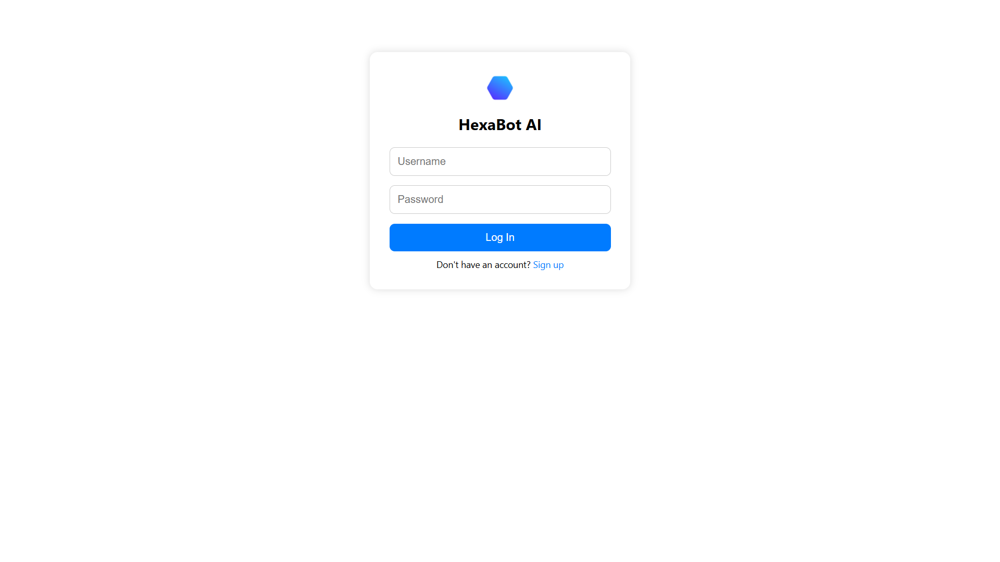
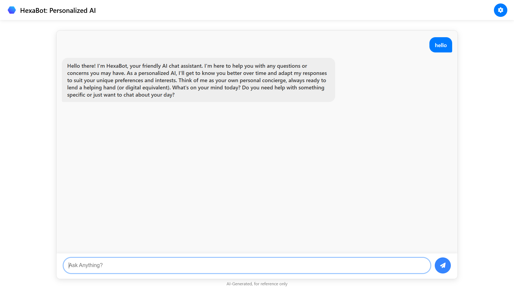
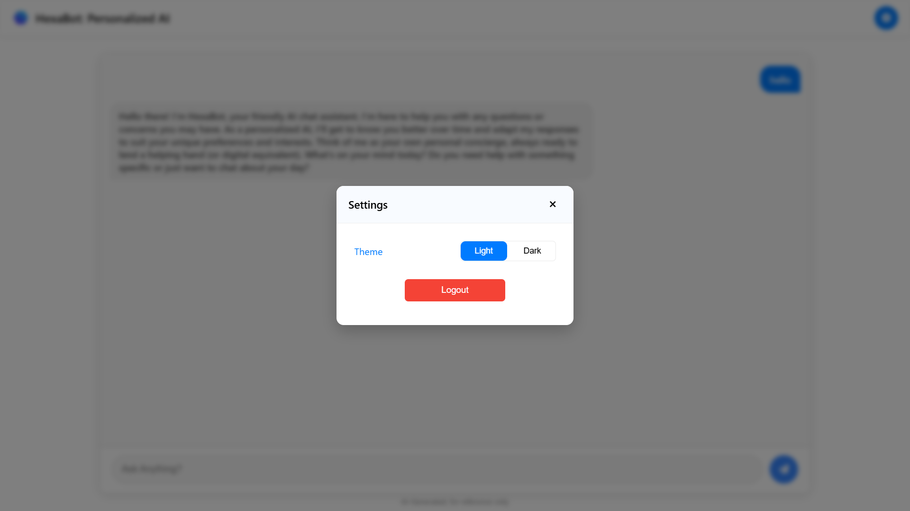

# 🚀 HEXABOT – A Personalized AI Chat Assistant

HEXABOT is a full-stack AI chat assistant designed to simulate intelligent, human-like conversation. Built using **React + Vite (frontend)**, **Flask & Node.js (backend)**, and integrated with the **LLaMA 3 model via Ollama**, HEXABOT allows for personalized chat interactions, user authentication, and persistent chat history.

---

## 🖥️ Project Features

- ✨ Personalized AI interaction using LLaMA 3 (local model)
- 🔐 User login and signup with hashed passwords
- 💬 Chat interface with real-time response rendering
- 🗂️ Persistent chat history stored in PostgreSQL
- 🌙 Light/Dark mode toggle
- 📦 Modular, scalable architecture

---

## 📷 Screenshots

### Login Page  


### Chat Interface  


### Settings & Sidebar  


> Make sure to save your screenshots inside a `screenshots/` folder in the root of the repo.

---

## ⚙️ Tech Stack

| Layer         | Technology                |
|---------------|---------------------------|
| Frontend      | React.js + Vite           |
| Backend       | Python Flask & Node.js    |
| AI Model      | LLaMA 3 (via Ollama)      |
| Database      | PostgreSQL                |
| Styling       | CSS (custom with dark/light mode) |
| API Testing   | Postman                   |
| Code Editor   | VS Code                   |

---

## 🧰 Prerequisites

Make sure you have the following installed:

- 🐍 Python 3.8+  
- 🟩 Node.js (v18 or later)  
- 🐘 PostgreSQL (latest)  
- 🐳 Ollama (https://ollama.com) with LLaMA 3 installed  
- npm / yarn  
- Git

---

## 📁 Project Structure

```
hexabot/

├── ollama_service.py       # Flask API for AI model
|── server.js               # Node server for auth/database
├── hexabot-frontend/
│   ├── src/
│   │   ├── components/
│   │   │   ├── Login.jsx, Signup.jsx, Chat.jsx, Sidebar.jsx
│   │   └── App.jsx
│   └── index.html, vite.config.js
├── db/
│   └── init_db.sql             # PostgreSQL schema
├── screenshots/
│   └── login.png, chat-ui.png, sidebar.png
├── README.md
└── package.json, requirements.txt
```

---

## 🚀 Getting Started

### 🔧 Step 1: Clone the Repository

```bash
git clone https://github.com/your-username/hexabot.git
cd hexabot
```

### 🧠 Step 2: Install LLaMA 3 using Ollama

1. Download and install [Ollama](https://ollama.com)
2. In terminal, run:
```bash
ollama run llama3
```

> This will download the LLaMA 3 model (~5GB) and launch the local AI.

---

### ⚙️ Step 3: Backend Setup

#### Flask API (ollama_service.py)

```bash
cd backend
pip install -r requirements.txt
python ollama_service.py
```

#### Node.js Server (server.js)

```bash
npm install
node server.js
```

---

### 💻 Step 4: Frontend Setup

```bash
cd frontend
npm install
npm run dev
```

App runs at: [http://localhost:5173](http://localhost:5173)

---

### 🐘 Step 5: PostgreSQL Setup

1. Open **pgAdmin**  
2. Create a database named `hexabot_db`  
3. Run the SQL script in `db/init_db.sql` to create tables: `users`, `chat_history`

---

## 📬 API Endpoints

| Method | Endpoint                  | Description                  |
|--------|---------------------------|------------------------------|
| POST   | `/register`               | User signup                  |
| POST   | `/login`                  | User login                   |
| POST   | `/chat/:userId`           | Send message to AI           |
| GET    | `/chat/:userId`           | Fetch chat history           |

---

## 🧪 Testing

- Use **Postman** to test routes (`localhost:5000/chat`)
- Check terminal logs for AI responses and DB inserts

---

## 🛠️ Future Enhancements

- 🎙️ Voice interaction
- ☁️ Cloud hosting (Render/Heroku)
- 🌐 Multi-language support
- 📱 Mobile app version

---

## 🙌 Authors

- Sareddy Shiva Pulla Reddy (Frontend & Integration)
- Panuganti Lokesh Venkat (Backend Developer)
- Karanamu Sai Eswar (Backend Developer)
- Puli Hemanth Shiridivas (Frontend Developer)
- Narasingh Gopichand
- Kowla Sai Teja

---

## 📄 License

This project is open-source and free to use for educational and personal purposes.

---
